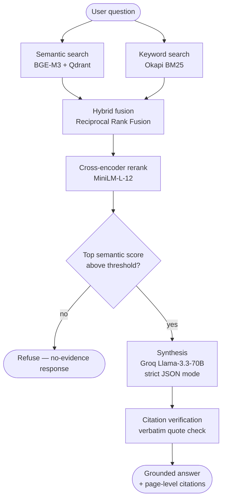

# cited-rx

**Citation-grounded RAG for clinical guidelines — every answer is traceable to a page, and the system refuses to answer when the source material doesn't support it.**


cited-rx is a retrieval-augmented question-answering system over medical clinical-guideline documents. It is built around a single principle: **an answer is only useful if you can verify where it came from.** Every response carries inline page-level citations, every quoted span is checked verbatim against the source text, and any question the corpus cannot support is explicitly refused rather than answered from the model's parametric knowledge.

The repository ships with a bundled cardiology corpus — the *2025 AHA/ACC Clinical Performance and Quality Measures for Chronic Coronary Disease* — and also accepts arbitrary user-uploaded PDFs through the same ingestion pipeline.

---

## Why this project

Most RAG demos retrieve some text, paste it into a prompt, and trust the model. cited-rx treats grounding and refusal as first-class, testable requirements:

- **Hybrid retrieval with cross-encoder reranking.** Queries are answered by fusing dense semantic search (BGE-M3) and sparse keyword search (BM25) with Reciprocal Rank Fusion, then rescoring the top candidates with a cross-encoder. This recovers results that pure vector search misses — exact terms and abbreviations such as "LDL-C" — while keeping semantic recall.
- **A confidence gate that refuses out-of-corpus questions.** Before the LLM is ever called, the top semantic similarity is checked against a calibrated threshold, and unrelated questions ("What is the capital of France?") are refused with a no-evidence response. The LLM is additionally instructed to report zero confidence and emit no citations when the retrieved context is insufficient — so refusal is enforced both before and during synthesis.
- **Verbatim citation verification.** The model must return an exact quote for every claim. Each quote is checked as a literal substring of its source chunk, and the response reports a `citation_verification_rate` — an objective, per-answer measure of grounding rather than a subjective judgement.
- **Page-level provenance.** Inline `[chunk_id=N]` markers are rendered to human-readable `(p. N)` references with a sources block, so any claim can be traced to a specific page of the source PDF.
- **A real evaluation harness.** A 30-question gold set (factual, multi-hop, edge-case, and out-of-corpus) is scored with Ragas for faithfulness, context precision, and context recall, plus refusal precision for out-of-corpus questions. Pipeline components are togglable so their contribution can be measured as ablations.
- **Tested like a service, not a notebook.** Unit, integration, API, and rendering suites cover the retrieval stack and the FastAPI layer — including that a pipeline crash degrades to a safe refusal instead of a 500, and that an injected instruction in the question is treated as data, not a command.

---

## Architecture



**Ingestion.** A PDF is parsed page by page with `pypdf`, lightly cleaned, and split into overlapping ~1000-character chunks (200-character overlap) using LangChain's `RecursiveCharacterTextSplitter`. Each chunk retains its source document and page number. Chunks are embedded with BGE-M3 into normalized 1024-dimensional vectors and indexed into a Qdrant collection named after the corpus. The same `ingest_pdf()` function backs both the command-line tools and the `/upload` endpoint.

**Retrieval.** A query is embedded and run against Qdrant for dense semantic candidates; in parallel, an Okapi BM25 index scores the same chunks by keyword overlap. The two ranked lists are merged with Reciprocal Rank Fusion (k = 60), and the top ~20 fused candidates are rescored by a cross-encoder reranker that jointly encodes the query and each chunk for a sharper relevance estimate. The top-k reranked chunks proceed to synthesis.

**Synthesis and refusal.** If the best semantic match falls below the similarity threshold, the system returns a no-evidence response without calling the LLM. Otherwise the reranked chunks are passed to a Groq-hosted Llama-3.3-70B model under a strict system prompt: answer only from the provided chunks, attach an inline `[chunk_id=N]` marker to every claim, and return a verbatim supporting quote per citation as validated JSON. Each returned quote is verified against its source chunk, citation markers are rendered to page numbers, and a sources block is appended.

---

## Tech stack

| Layer | Technology |
| :--- | :--- |
| API & UI | FastAPI, Uvicorn, Gradio |
| Vector store | Qdrant (local mode, cosine distance) |
| Embeddings | BGE-M3, 1024-d, via `sentence-transformers` |
| Reranking | `cross-encoder/ms-marco-MiniLM-L-12-v2` |
| Keyword retrieval | `rank-bm25` (Okapi BM25) |
| LLM | Groq — Llama-3.3-70B (synthesis), Llama-3-8B (eval judge) |
| Chunking | LangChain `RecursiveCharacterTextSplitter` |
| PDF parsing | `pypdf` |
| Evaluation | Ragas |
| Schemas & validation | Pydantic v2 |
| Testing | pytest |

---

## Getting started

### Prerequisites

- **Python 3.10+**
- A **Groq API key** (a free tier is available at [console.groq.com](https://console.groq.com))
- Roughly **2–3 GB of disk** for the embedding and reranker models, which download on first run. A GPU is optional — everything runs on CPU.

### Installation

```bash
git clone https://github.com/yourusername/cited-rx.git
cd cited-rx

python -m venv .venv
source .venv/bin/activate        # on Windows: .venv\Scripts\activate

pip install -r requirements.txt
```

### Configure your API key

Create a `.env` file in the project root:

```env
GROQ_API_KEY=your_groq_api_key_here
```

All other settings have sensible defaults — see the [configuration reference](#configuration-reference) to override models or data paths.

### Index the bundled corpus

The guideline PDF is not committed to the repository. Obtain a copy and place it at `data/raw/guideline.pdf`, then run the three-stage ingestion pipeline:

```bash
python read_pdf.py        # parse + chunk  -> data/processed/
python embed_chunks.py    # embed chunks   -> data/processed/
python index.py           # push to Qdrant -> collection 'cited_rx_chunks'
```

Each step defaults to the `cited_rx_chunks` corpus. As a one-shot alternative:

```bash
python -m backend.ingest --pdf data/raw/guideline.pdf --corpus cited_rx_chunks
```

> **Note:** Qdrant runs in local (embedded) mode, which allows only one client at a time. Stop the API server before running ingestion or the integration tests against the same database.

---

## Running the application

```bash
uvicorn backend.api:app --host 127.0.0.1 --port 8000
```

- **Web UI** — [http://127.0.0.1:8000](http://127.0.0.1:8000) (Gradio chat interface)
- **API docs** — [http://127.0.0.1:8000/docs](http://127.0.0.1:8000/docs) (interactive Swagger)

---

## Usage

### REST API

Ask a grounded question:

```bash
curl -X POST http://127.0.0.1:8000/query/grounded \
  -H "Content-Type: application/json" \
  -d '{"question": "What is the recommended LDL-C target?"}'
```

```json
{
  "answer": "The recommended LDL-C target is <70 mg/dL (p. 27) ...",
  "confidence": 0.8,
  "citations": [{ "chunk_id": 174, "page_number": 27, "quote": "..." }],
  "refused": false,
  "citation_verification_rate": 1.0
}
```

Upload a new PDF as a fresh corpus:

```bash
curl -X POST http://127.0.0.1:8000/upload -F "file=@your_document.pdf"
```

| Endpoint | Method | Description |
| :--- | :--- | :--- |
| `/health` | `GET` | Service health check |
| `/query/grounded` | `POST` | Grounded answer with page-level citations |
| `/upload` | `POST` | Ingest a PDF into a new queryable corpus |

The query endpoint validates its inputs (returning `422` for out-of-range parameters and `404` for an unknown corpus) and never leaks a stack trace — an internal failure degrades to a safe no-evidence response.

### Web UI

The Gradio interface lets you chat with the bundled cardiology corpus, upload your own PDF to query instead, and reset back to the default corpus. Refused (out-of-corpus) answers are flagged distinctly from grounded ones.

---

## Evaluation

The gold set (`data/eval/gold.json`) contains 30 questions across four categories:

| Category | Count | Purpose |
| :--- | :---: | :--- |
| `factual` | 10 | Single-fact lookups |
| `multi_hop` | 10 | Answers requiring synthesis across pages |
| `edge_case` | 5 | Subtle scope and exclusion questions |
| `out_of_corpus` | 5 | Questions the system should refuse |

Run the pipeline over the gold set, then score it:

```bash
python -m eval.runner  --config baseline                              # also: no_reranker, no_gate
python -m eval.metrics --run data/eval/runs/<timestamp>_baseline.json  # Ragas scoring
python -m eval.calibrate_threshold                                     # tune the similarity gate
```

`runner.py` exposes three configurations so each component can be measured as an ablation: `baseline` (full pipeline), `no_reranker` (hybrid retrieval only), and `no_gate` (refusal disabled). Results — fill in from your latest run:

| Configuration | Faithfulness | Context precision | Context recall | Refusal precision |
| :--- | :---: | :---: | :---: | :---: |
| `baseline` | – | – | – | – |
| `no_reranker` | – | – | – | – |
| `no_gate` | – | – | – | – |

A fast end-to-end sanity check is also available — `python tests/smoke_test.py` runs five real queries and asserts correct answer-vs-refusal behavior, saving a baseline for before/after comparison during refactors.

---

## Testing

```bash
pytest                              # full suite
pytest tests/test_api.py            # API layer — fully mocked, no LLM or Qdrant
pytest tests/test_integration.py    # retrieval stack against a live local Qdrant
```

| Suite | Coverage |
| :--- | :--- |
| `test_unit.py` | Core unit-level logic |
| `test_api.py` | FastAPI endpoints with the pipeline and Qdrant mocked — validation, error handling, prompt-injection resistance |
| `test_integration.py` | Semantic, BM25, hybrid (RRF), and reranker retrieval against a live indexed corpus |
| `test_render.py` | Citation marker rendering and the sources block |
| `smoke_test.py` | End-to-end query + refusal behavior |

> Integration tests require an indexed corpus and must not run while the API server is using the same Qdrant database.

---

## Project structure

```
cited-rx/
├── config.py               # paths, models, retrieval constants
├── conftest.py             # test path setup
├── requirements.txt
├── read_pdf.py             # CLI: PDF -> chunks
├── embed_chunks.py         # CLI: chunks -> embeddings
├── index.py                # CLI: embeddings -> Qdrant
├── backend/
│   ├── api.py              # FastAPI app + Gradio mount
│   ├── ui.py               # Gradio interface
│   ├── pipeline.py         # end-to-end RAG orchestration
│   ├── ingest.py           # corpus-aware ingestion pipeline
│   ├── retrieve.py         # semantic search (BGE-M3 + Qdrant)
│   ├── retrieve_bm25.py    # keyword search (Okapi BM25)
│   ├── retrieve_hybrid.py  # Reciprocal Rank Fusion
│   ├── rerank.py           # cross-encoder reranking
│   ├── synthesize.py       # LLM synthesis, gate, citation verification
│   ├── schemas.py          # Pydantic / dataclass models
│   └── state.py            # shared app state
├── eval/
│   ├── runner.py           # run the gold set (with ablation configs)
│   ├── metrics.py          # Ragas scoring
│   ├── calibrate_threshold.py
│   ├── recompute_summary.py
│   └── gold.json           # 30-question evaluation set
├── tests/
│   ├── test_unit.py
│   ├── test_api.py
│   ├── test_integration.py
│   ├── test_render.py
│   └── smoke_test.py
└── data/                   # raw PDFs, processed chunks, Qdrant storage, eval runs
```

*Adjust the layout above to match your actual repository if the CLI or eval scripts live elsewhere.*

---

## Configuration reference

All settings are read by `config.py` and can be overridden with environment variables.

| Variable | Default | Purpose |
| :--- | :--- | :--- |
| `GROQ_API_KEY` | *(required)* | Groq API authentication |
| `LLM_PROVIDER` | `groq` | LLM provider |
| `GROQ_MODEL` | `llama-3.3-70b-versatile` | Synthesis model |
| `GROQ_EVAL_MODEL` | `llama3-8b-8192` | Ragas judge model |
| `CITED_RX_DATA_DIR` | `./data` | Root data directory |
| `CITED_RX_QDRANT` | `./data/qdrant_storage` | Qdrant storage path |
| `CITED_RX_PROCESSED` | `./data/processed` | Chunk & embedding cache |
| `CITED_RX_RAW` | `./data/raw` | Source PDFs |
| `CITED_RX_EVAL` | `./data/eval` | Evaluation artifacts |

Fixed constants in `config.py`: chunk size `1000` / overlap `200`, embedding dimension `1024`, RRF constant `60`, and similarity threshold `0.50`.

---

## Limitations & future work

- Qdrant runs in local (embedded) mode and permits only one client at a time — the API server, CLI ingestion, and integration tests cannot run concurrently against the same database. Moving to a server-mode Qdrant would remove this constraint.
- Ingestion depends on the PDF's embedded text layer; scanned or image-only PDFs are rejected and would require an OCR stage.
- Retrieval and reranking run on CPU by default, so first-query latency includes model loading and throughput is modest without a GPU.
- Citation verification is an exact-substring check — it catches fabricated quotes but not paraphrased or subtly altered ones.
- The similarity threshold is calibrated against the bundled corpus; user-uploaded corpora may warrant recalibration via `eval/calibrate_threshold.py`.

---

## License

No license file is currently included. Add a `LICENSE` (for example, MIT) to make the terms of reuse explicit. Note that the bundled clinical guideline is a third-party document — review its terms before redistributing the PDF itself.
